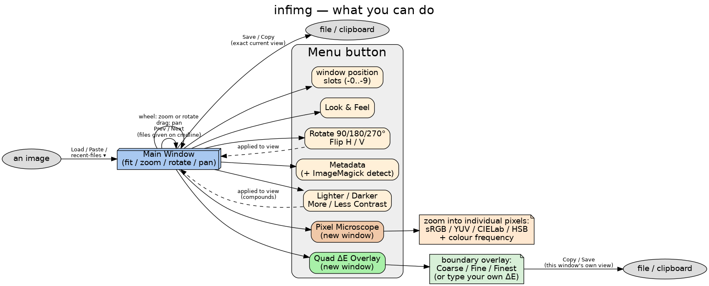

# infimg



A small, cross-platform (Linux/macOS/Windows) Java/Swing image viewer that
does the one thing no OS default viewer seems to get right: fit-to-window
plus genuinely arbitrary-angle rotation, in one native, embeddable,
scriptable tool.

## Why

- **Linux**: no strong default at all. Nemo's built-in viewer only rotates
  in right angles; feh needs `-Z`/`--auto-zoom` to fit-to-window and still
  feels rough; nomacs/geeqie are close but neither is pre-installed
  anywhere.
- **macOS**: Preview.app is solid (fit-to-window, zoom/pan, fast) but
  right-angle rotation only.
- **Windows**: the stock Photos app is slow and cloud-oriented; the old
  Windows Photo Viewer (right-angle only) got buried. IrfanView has
  free-angle rotation but is Windows-only and a closed black box — no
  programmatic hooks, nothing to embed.

Nothing free-angle-rotates *and* is cross-platform *and* is
embeddable/scriptable — except GIMP, which is enormous overkill for "look
at an image and maybe straighten it."

## Features

- Fit-to-window, mouse-wheel zoom, arbitrary-angle rotate, click-drag pan.
- Load/Save/Paste/Copy, plus a recent-files dropdown and Prev/Next through
  files given on the command line.
- A **Menu** button for everything else: quick 90°/180°/270° rotate and
  flip, window-position slots, look-and-feel, one-click brightness/contrast
  nudges, a Pixel Microscope for inspecting individual pixel colours, and a
  Quad ΔE Overlay for spotting subtle content a page-scan might be hiding.
- Full command-line control for scripting.

Full feature-by-feature reference, config file format, and changelog:
[MANUAL.md](MANUAL.md).

## Install & run

See [INSTALL.md](INSTALL.md) — install [MITSA](https://github.com/Walter-Stroebel/mitsa)
once, then `mitsa add infimg Walter-Stroebel infimg` gets you a working
`infimg` command on `PATH` that stays updated.

## Build (development)

```bash
mvn package
java -jar target/infimg-1.8-jar-with-dependencies.jar [-0..-9] [optional-image-file]
```

## Dependencies

Just `jackson-databind`, used only to read/write the small config file.
Everything else is JDK Swing/AWT/`ImageIO`. Some **Menu** features use
optional external command-line tools if you tell infimg they're installed —
see [MANUAL.md](MANUAL.md).

## Status

Extracted 2026-08-10 from a Voynich manuscript research project, where it
started as a "show me something" tool for pulling traced page regions up
on screen. General-purpose, no dependency on that project.
